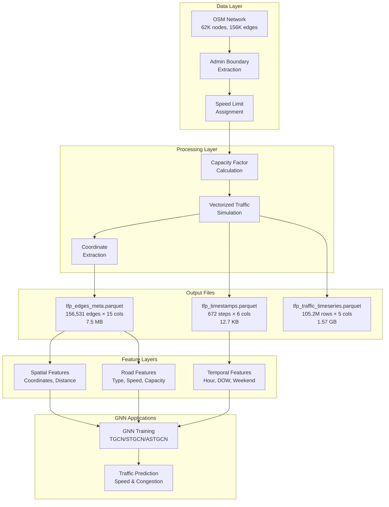

# Traffic Flow Prediction — Dhaka Urban Network

## Overview

This component implements **traffic flow prediction** for the Dhaka urban transportation network using Graph Neural Networks (GNNs). The project generates high-quality, spatially-aware traffic datasets and provides production-ready Parquet files optimized for time-series forecasting tasks.

### Objectives

- Generate production-ready traffic flow datasets with spatial and temporal features
- Provide comprehensive edge metadata with coordinates and road attributes  
- Create time-series traffic observations (105M+ rows) with multiple prediction targets
- Enable GNN-based traffic prediction and speed forecasting

---

## Architecture Overview



---

## Files & Notebooks

### Notebooks

- **`tfp_dataset_generator.ipynb`** (Cells 0-12)
  - OSM network download and boundary extraction
  - Speed limit assignment (BRTA standards)
  - Capacity factor calculation by road type
  - Vectorized traffic simulation (7-day period)
  - Parquet file generation with Snappy compression

- **`traffic_flow_prediction.ipynb`**
  - Main prediction pipeline and analysis
  - Data loading and exploration
  - GNN model implementation
  - Evaluation and visualization

### Output Directory

```
traffic_flow_prediction/
├── tfp_edges_meta.parquet              (7.5 MB)
├── tfp_timestamps.parquet              (12.7 KB)
└── tfp_traffic_timeseries.parquet      (1.57 GB)
```

---

## Output Datasets

### 1. tfp_edges_meta.parquet (7.5 MB)

**Static edge metadata with spatial coordinates for GNN construction**

**Schema (15 columns):**

| Column | Type | Description |
|--------|------|-------------|
| `eidx` | uint32 | Edge index (joins timeseries data) |
| `edge_id` | string | Unique identifier (u_v_k format) |
| `u` | int64 | Source OSM node ID |
| `v` | int64 | Target OSM node ID |
| `u_lat`, `u_lon` | float32 | Source node coordinates (WGS-84) |
| `v_lat`, `v_lon` | float32 | Target node coordinates (WGS-84) |
| `mid_lat`, `mid_lon` | float32 | Edge midpoint coordinates |
| `haversine_m` | float32 | Straight-line distance (meters) |
| `road_type` | category | OSM highway type |
| `length_m` | float32 | Edge length from OSM (meters) |
| `free_speed_kmh` | float32 | BRTA speed limit (km/h) |
| `capacity_factor` | float32 | Road capacity index [0, 1] |

**Spatial Coverage:**
- Bounding box: 23.60°–23.95°N, 90.25°–90.55°E (Dhaka)
- Total edges: 156,531
- Coordinate system: WGS-84 (EPSG:4326)

### 2. tfp_timestamps.parquet (12.7 KB)

**Temporal metadata for all observation timestamps**

**Schema (6 columns):**

| Column | Type | Description |
|--------|------|-------------|
| `ts_idx` | uint16 | Timestamp index (0–671) |
| `timestamp` | datetime | Full timestamp (Asia/Dhaka timezone) |
| `dow` | uint8 | Day of week (0=Monday, 6=Sunday) |
| `hour` | uint8 | Hour of day (0–23) |
| `minute` | uint8 | Minute (0, 15, 30, 45) |
| `is_weekend` | uint8 | Binary flag (1=Friday/Saturday) |

**Coverage:**
- Period: January 6–12, 2025 (7 days)
- Frequency: 15-minute intervals
- Total timestamps: 672

### 3. tfp_traffic_timeseries.parquet (1.57 GB)

**Time-series traffic observations for all edges and timestamps**

**Schema (5 columns):**

| Column | Type | Description |
|--------|------|-------------|
| `ts_idx` | uint16 | Timestamp index (joins tfp_timestamps) |
| `eidx` | uint32 | Edge index (joins tfp_edges_meta) |
| `travel_time_s` | float32 | Travel time in seconds |
| `current_speed_kmh` | float32 | Current speed in km/h |
| `traffic_factor` | float32 | Congestion index [0, 1] |

**Volume:**
- Total rows: 105,188,832
- Calculation: 156,531 edges × 672 timestamps

**Prediction Targets:**
- `traffic_factor`: Primary congestion metric (0–1 scale)
- `current_speed_kmh`: Interpretable speed metric

---

## Installation & Setup

### Requirements

```
python>=3.9
numpy>=1.20
pandas>=1.1
networkx>=3.6
osmnx==1.9.3
geopandas>=1.1
shapely>=2.0
pyproj>=3.7
fiona>=1.10
pyarrow>=23.0
tqdm
```

### Installation Steps

```bash
# Clone repository
git clone https://github.com/Traffic-Flow/Traffic-Flow-Prediction.git
cd Traffic-Flow-Prediction

# Create virtual environment
python -m venv venv
source venv/bin/activate  # Windows: venv\Scripts\activate

# Install dependencies
pip install -r requirements.txt
```

---

## Usage Guide

### Step 1: Generate Datasets

Open `tfp_dataset_generator.ipynb` and run all cells.

**Key Parameters (Cell 2):**

```python
START = "2025-01-06 00:00:00"             # Monday start
END = "2025-01-12 23:45:00"               # Sunday end  
FREQ = "15min"                            # 15-minute intervals
OUT_DIR = r"./traffic_flow_prediction"    # Output directory
SAMPLE_EDGES = None                       # None for all; int for quick test
```

**Processing Time:**
- OSM download + boundary extraction: ~2 min
- Traffic simulation: ~41 sec
- **Total: ~3 minutes**

**Output:**
- `tfp_edges_meta.parquet` (7.5 MB)
- `tfp_timestamps.parquet` (12.7 KB)
- `tfp_traffic_timeseries.parquet` (1.57 GB)

### Step 2: Load Data for Analysis

```python
import pandas as pd

# Load edge metadata
edges = pd.read_parquet('tfp_edges_meta.parquet')
print(f"Edges: {len(edges):,}")
print(f"Columns: {edges.columns.tolist()}")

# Load timestamps
timestamps = pd.read_parquet('tfp_timestamps.parquet')
print(f"Timestamps: {len(timestamps)}")

# Load traffic timeseries
traffic = pd.read_parquet('tfp_traffic_timeseries.parquet')
print(f"Observations: {len(traffic):,}")

# Combine for full feature matrix
df = traffic.merge(edges, on='eidx').merge(timestamps, on='ts_idx')
print(f"Full dataset shape: {df.shape}")
```

### Step 3: Prepare for GNN Training

```python
import networkx as nx

# Build spatial graph
G = nx.DiGraph()
for _, row in edges.iterrows():
    G.add_edge(
        int(row['u']), int(row['v']),
        edge_idx=int(row['eidx']),
        length_m=float(row['length_m']),
        haversine_m=float(row['haversine_m']),
        free_speed_kmh=float(row['free_speed_kmh'])
    )

# Extract node coordinates
node_features = {}
for _, row in edges.iterrows():
    if row['u'] not in node_features:
        node_features[row['u']] = [row['u_lat'], row['u_lon']]
    if row['v'] not in node_features:
        node_features[row['v']] = [row['v_lat'], row['v_lon']]

# Extract edge features (spatial attributes)
edge_features = edges[['u_lat', 'u_lon', 'v_lat', 'v_lon', 
                       'haversine_m', 'length_m', 'free_speed_kmh']].values

# Extract temporal features
temporal_features = timestamps[['hour', 'dow', 'is_weekend']].values

# Extract target variable (traffic_factor)
target = traffic['traffic_factor'].values
```

### Step 4: Quick Data Exploration

```python
# Peak hour analysis
peak_hours = traffic[traffic['ts_idx'].isin(
    timestamps[(timestamps['hour'].isin([7, 8, 9, 17, 18, 19]))]['ts_idx']
)]
print(f"Peak hour average speed: {peak_hours['current_speed_kmh'].mean():.1f} km/h")
print(f"Peak hour average factor: {peak_hours['traffic_factor'].mean():.3f}")

# Road type comparison
edge_traffic = traffic.merge(edges[['eidx', 'road_type']], on='eidx')
road_stats = edge_traffic.groupby('road_type').agg({
    'current_speed_kmh': 'mean',
    'traffic_factor': 'mean',
    'travel_time_s': 'mean'
}).round(2)
print(road_stats)

# Temporal pattern
hourly_stats = traffic.merge(timestamps[['ts_idx', 'hour']], on='ts_idx').groupby('hour').agg({
    'current_speed_kmh': 'mean',
    'traffic_factor': 'mean'
})
print(hourly_stats)
```

---

## Traffic Model Details

### Congestion Factor Calculation

```
Base hour-of-day pattern (Dhaka-calibrated):
- 00:00–05:00: 0.12 (night, free flow)
- 05:00–07:00: 0.28 (early morning)
- 07:00–10:00: 0.82 (AM peak)
- 10:00–12:00: 0.38 (mid-morning)
- 12:00–14:00: 0.48 (lunch)
- 14:00–17:00: 0.40 (afternoon)
- 17:00–20:00: 0.85 (PM peak)
- 20:00–22:00: 0.35 (evening)
- 22:00–00:00: 0.18 (late evening)

Weekend adjustment: base × 0.60
Friday Jumu'ah spike (12–14h): base × 1.25

Road capacity effect: 
  factor *= (1.0 + (1.0 - capacity_factor) × 0.6)

Stochastic noise: N(0, 0.10)
Final range: [0.05, 1.00]
```

### Speed Degradation Model

```python
# Current speed from congestion factor
current_speed = max(free_speed × (1 - 0.8 × traffic_factor), MIN_SPEED_KPH)
MIN_SPEED_KPH = 5.0

# Travel time calculation
travel_time_s = length_m / (current_speed_kmh × 1000 / 3600)

# Example:
# free_speed = 50 km/h, traffic_factor = 0.7, length = 100m
# current_speed = max(50 × (1 - 0.56), 5) = 22 km/h
# travel_time = 100 / (22 × 1000/3600) = 16.4 seconds
```

---

## Recommended GNN Architectures

**Temporal Graph Convolution Network (TGCN)**
- Combines graph convolution with LSTM
- Best for capturing spatial dependencies + temporal dynamics
- Input: Node features + adjacency matrix + time series

**Spatial-Temporal Graph Convolution Network (STGCN)**
- Joint spatial-temporal convolution
- Efficient for large graphs with regular temporal patterns
- Input: Graph snapshots at each time step

**Attention-based Spatial-Temporal Graph (ASTGCN)**
- Learns importance weights for nodes/time steps
- Best for capturing non-uniform traffic patterns
- Input: Graph + temporal features + attention masks

---

## Data Statistics

| Metric | Value |
|--------|-------|
| **Geographic Area** | ~3,150 km² (Dhaka + 200m buffer) |
| **Total Edges** | 156,531 |
| **Total Timestamps** | 672 |
| **Total Observations** | 105,188,832 |
| **Time Span** | 7 days (1 week) |
| **Time Resolution** | 15 minutes |
| **Data Volume (raw)** | ~8–10 GB |
| **Data Volume (compressed)** | 1.57 GB |
| **Compression Ratio** | ~5.5× |
| **Avg Speed (peak hours)** | 15–25 km/h |
| **Avg Speed (off-peak)** | 40–50 km/h |

---

## Important Notes

### Data Characteristics

- **Synthetic/Simulated**: Generated for research purposes (not real-world observations)
- **Deterministic**: Reproducible with `RANDOM_SEED = 42`
- **Timezone**: All timestamps in Asia/Dhaka (UTC+6)
- **Coverage**: Dhaka City Corporation boundary + 200m buffer
- **Speed Standards**: BRTA (Bangladesh Road Transport Authority) guidelines

### Limitations

- Fixed capacity factors (not validated against real data)
- Simplified congestion model (no incidents, special events)
- Linear speed degradation model
- No OD matrix validation
- 7-day sample (not representative of year-round patterns)

### Data Validation

```python
# Verify data integrity
assert len(edges) == 156_531, "Edge count mismatch"
assert len(timestamps) == 672, "Timestamp count mismatch"
assert traffic['eidx'].max() == 156_530, "Edge index out of range"
assert (timestamps['ts_idx'].diff()[1:] == 1).all(), "Missing timestamps"
assert (traffic['traffic_factor'].between(0.05, 1.0)).all(), "Factor out of range"
assert (traffic['current_speed_kmh'] >= 5).all(), "Speed below minimum"
```
