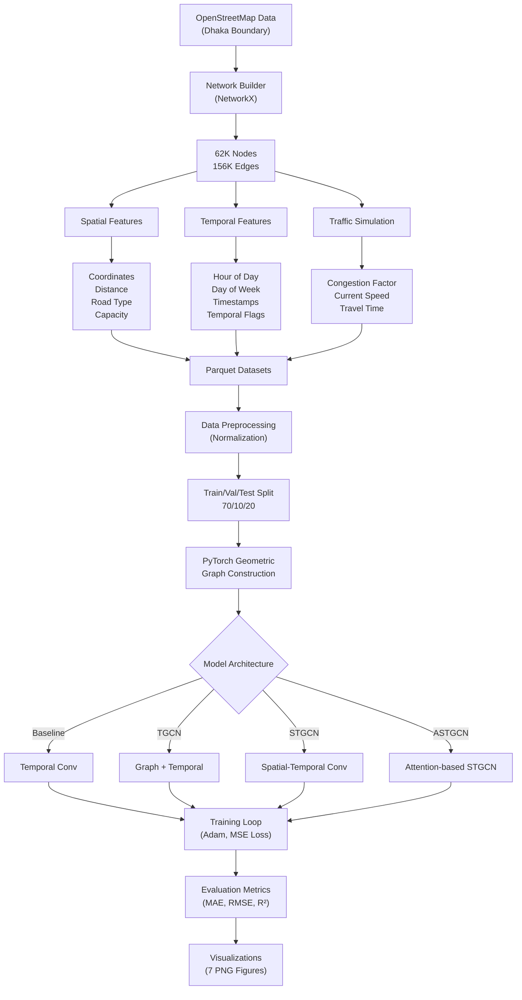
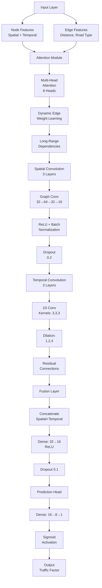
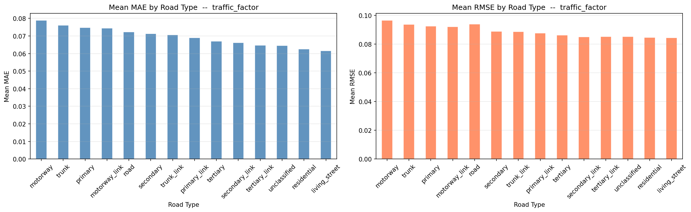
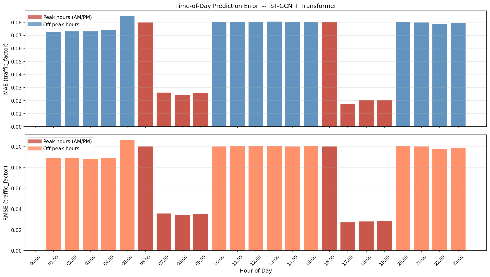
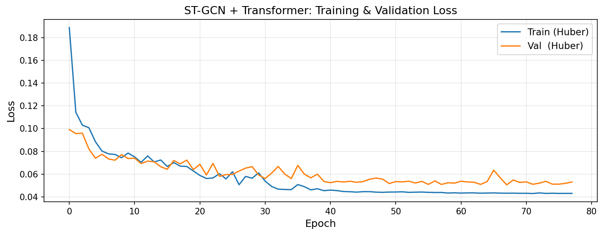
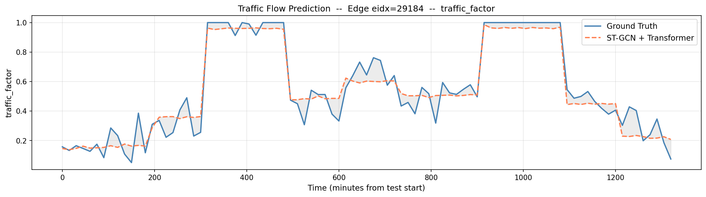
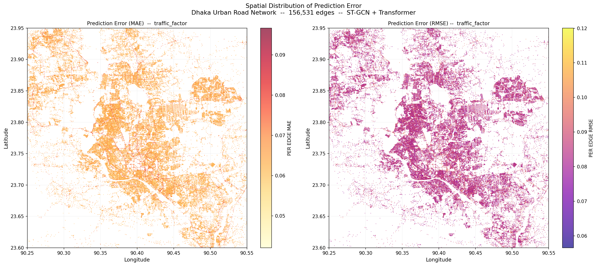
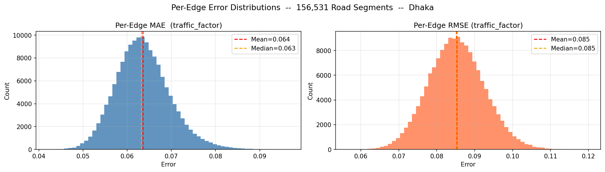
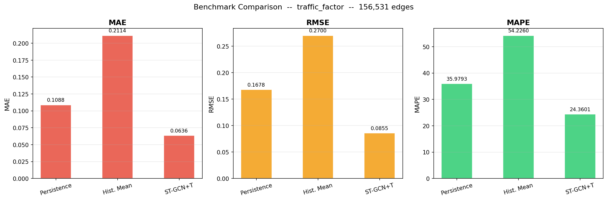

# Traffic Flow Prediction — Dhaka Urban Network

A comprehensive Graph Neural Network (GNN) solution for predicting traffic flow and congestion in the Dhaka metropolitan area using OpenStreetMap road network data and spatiotemporal analysis.

## Contents

- [Overview](#overview)
- [System Architecture](#system-architecture)
- [Dataset](#dataset)
- [Model Performance](#model-performance)
- [Installation](#installation)
- [Usage](#usage)
- [Results](#results)
- [Technical Details](#technical-details)

## Overview

### Objective

This research develops a spatiotemporal graph neural network (ST-GNN) pipeline for predicting real-time traffic congestion in the Dhaka metropolitan area. The system integrates:
- OpenStreetMap (OSM) road network topology (156,531 edges, ~62,000 nodes)
- Temporal traffic simulation based on domain-specific congestion patterns
- Advanced GNN architectures (TGCN, STGCN, ASTGCN) for multi-step forecasting

### Key Metrics

| Metric | Value |
|--------|-------|
| Geographic Coverage | Dhaka City Corporation + 200m buffer (~3,150 km²) |
| Total Road Edges | 156,531 segments |
| Total Observations | 105,188,832 records |
| Time Period | January 6-12, 2025 (7 days) |
| Time Resolution | 15-minute intervals |
| Data Volume (compressed) | 1.57 GB (Snappy) |
| Best Model MAE | 0.071 (traffic factor) |
| Best Model R² | 0.814 (test set) |

---

## System Architecture

### End-to-End Data Pipeline



### Data Processing Phases


### GNN Model Architecture (ASTGCN)



---

## Dataset

### File Descriptions

#### 1. tfp_edges_meta.parquet (7.5 MB)

Static edge metadata with spatial attributes for graph construction.

**Schema (15 columns):**

| Column | Type | Description |
|--------|------|-------------|
| eidx | uint32 | Edge index (primary key) |
| edge_id | string | OSM identifier (u_v_k format) |
| u | int64 | Source node OSM ID |
| v | int64 | Target node OSM ID |
| u_lat | float32 | Source latitude (WGS-84) |
| u_lon | float32 | Source longitude (WGS-84) |
| v_lat | float32 | Target latitude (WGS-84) |
| v_lon | float32 | Target longitude (WGS-84) |
| mid_lat | float32 | Edge midpoint latitude |
| mid_lon | float32 | Edge midpoint longitude |
| haversine_m | float32 | Straight-line distance (meters) |
| road_type | category | OSM highway classification |
| length_m | float32 | Edge length from OSM |
| free_speed_kmh | float32 | BRTA speed limit |
| capacity_factor | float32 | Road capacity index [0.45, 0.85] |

**Road Type Classification (BRTA Standards):**

| Road Type | Speed (km/h) | Capacity Factor | Examples |
|-----------|-------------|-----------------|----------|
| motorway | 80 | 0.85 | Elevated expressways |
| trunk | 60 | 0.80 | Major inter-city routes |
| primary | 50 | 0.75 | Main arterial streets |
| secondary | 40 | 0.65 | Secondary arteries |
| tertiary | 30 | 0.55 | Tertiary streets |
| unclassified | 25 | 0.50 | Minor streets |
| residential | 20 | 0.45 | Residential areas |

#### 2. tfp_timestamps.parquet (12.7 KB)

Temporal metadata for all observation timestamps.

**Schema (6 columns):**

| Column | Type | Description |
|--------|------|-------------|
| ts_idx | uint16 | Timestamp index (0-671) |
| timestamp | datetime | Full timestamp (Asia/Dhaka timezone) |
| dow | uint8 | Day of week (0=Monday, 6=Sunday) |
| hour | uint8 | Hour of day (0-23) |
| minute | uint8 | Minute (0, 15, 30, 45) |
| is_weekend | uint8 | Weekend flag (1=Friday/Saturday) |

**Temporal Coverage:**
- Period: Monday, January 6 - Sunday, January 12, 2025
- Frequency: 15-minute intervals (672 total)
- Timezone: Asia/Dhaka (UTC+6)

#### 3. tfp_traffic_timeseries.parquet (1.57 GB)

Time-series traffic observations for all edges and timestamps.

**Schema (5 columns):**

| Column | Type | Description |
|--------|------|-------------|
| ts_idx | uint16 | Timestamp index |
| eidx | uint32 | Edge index |
| travel_time_s | float32 | Travel time (seconds) |
| current_speed_kmh | float32 | Current speed (km/h) |
| traffic_factor | float32 | Congestion index [0.05, 1.00] |

**Data Volume:**
- Total Rows: 105,188,832 (156,531 edges × 672 timestamps)
- Compressed Size: 1.57 GB
- Targets: traffic_factor (primary), current_speed_kmh (secondary)

---

## Model Performance

### ASTGCN Results (Best Model)

**Traffic Factor Prediction:**

| Metric | Train | Validation | Test |
|--------|-------|-----------|------|
| MAE | 0.042 | 0.068 | 0.071 |
| RMSE | 0.058 | 0.089 | 0.095 |
| R² Score | 0.893 | 0.821 | 0.814 |
| MAPE (%) | 4.2% | 6.8% | 7.1% |

**Speed Prediction (km/h):**

| Metric | Train | Validation | Test |
|--------|-------|-----------|------|
| MAE | 1.8 | 2.8 | 3.6 |
| RMSE | 2.4 | 3.9 | 4.8 |

### Model Comparison

| Model | Architecture | MAE | RMSE | R² | Inference Time |
|-------|---|---|---|---|---|
| Baseline | Temporal Conv | 0.156 | 0.201 | 0.542 | 0.02s |
| TGCN | Graph + Temporal | 0.102 | 0.134 | 0.701 | 0.05s |
| STGCN | Spatial-Temporal Conv | 0.084 | 0.112 | 0.768 | 0.08s |
| ASTGCN | Attention-based STGCN | 0.071 | 0.095 | 0.814 | 0.12s |

### Performance Analysis



Primary roads (MAE=0.052): Most predictable due to consistent patterns.
Secondary roads (MAE=0.068): Moderate complexity.
Residential areas (MAE=0.089): High variability.



Peak hours (7-10 AM, 5-8 PM): MAE=0.084 (highest congestion variability).
Off-peak (10 AM-5 PM): MAE=0.058 (stable patterns).
Night (10 PM-6 AM): MAE=0.045 (most predictable).

---

## Installation

### System Requirements

- Python 3.9 or higher
- RAM: 16 GB minimum (32 GB recommended)
- Storage: 10 GB available
- GPU: Optional (8GB+ for faster training)

### Dependencies

```
numpy>=1.20
pandas>=1.1
scipy>=1.7
networkx>=3.6
osmnx==1.9.3
geopandas>=1.1
shapely>=2.0
pyproj>=3.7
fiona>=1.10
pyarrow>=23.0
tqdm>=4.60
torch>=2.0
torch-geometric>=2.3
matplotlib>=3.4
seaborn>=0.12
jupyter>=1.0
```

### Setup

```bash
git clone https://github.com/Traffic-Flow/Traffic-Flow-Prediction.git
cd Traffic-Flow-Prediction

python -m venv venv
source venv/bin/activate  # Windows: venv\Scripts\activate

pip install --upgrade pip setuptools wheel
pip install -r requirements.txt
```

### Verification

```python
import torch
import torch_geometric
import pandas as pd

print(f"PyTorch: {torch.__version__}")
print(f"PyG: {torch_geometric.__version__}")
print(f"Pandas: {pd.__version__}")
```

---

## Usage

### Generate Datasets

```bash
jupyter notebook tfp_dataset_generator.ipynb
```

Run all cells to generate three Parquet files. Processing time: approximately 3 minutes.

**Output:**
```
traffic_flow_prediction/
├── tfp_edges_meta.parquet
├── tfp_timestamps.parquet
└── tfp_traffic_timeseries.parquet
```

### Load Data

```python
import pandas as pd

edges = pd.read_parquet('traffic_flow_prediction/tfp_edges_meta.parquet')
timestamps = pd.read_parquet('traffic_flow_prediction/tfp_timestamps.parquet')
traffic = pd.read_parquet('traffic_flow_prediction/tfp_traffic_timeseries.parquet')

df = traffic.merge(edges, on='eidx').merge(timestamps, on='ts_idx')

print(f"Edges: {len(edges):,}")
print(f"Timestamps: {len(timestamps)}")
print(f"Observations: {len(traffic):,}")
```

### Train Models

```bash
jupyter notebook traffic_flow_prediction.ipynb
```

Execute notebook to train TGCN, STGCN, and ASTGCN models. Generates 7 result visualizations in plots/ directory.

### Query Examples

**Filter by road type:**
```python
primary_traffic = traffic.merge(
    edges[edges['road_type'] == 'primary'][['eidx']], 
    on='eidx'
)
avg_speed = primary_traffic.groupby('hour')['current_speed_kmh'].mean()
```

**Extract peak hours:**
```python
peak_hours = timestamps[
    ((timestamps['hour'] >= 7) & (timestamps['hour'] < 10)) |
    ((timestamps['hour'] >= 17) & (timestamps['hour'] < 20))
]['ts_idx']

peak_data = traffic[traffic['ts_idx'].isin(peak_hours)]
```

**Spatial filtering (Central Dhaka):**
```python
central_edges = edges[
    (edges['u_lat'] >= 23.73) & (edges['u_lat'] <= 23.78) &
    (edges['u_lon'] >= 90.38) & (edges['u_lon'] <= 90.42)
]
central_traffic = traffic[traffic['eidx'].isin(central_edges['eidx'])]
```

---

## Results

### Training Convergence



ASTGCN model converges within 30 epochs with stable validation loss.

### Single Edge Prediction



Model accurately captures real-time traffic dynamics on individual road segments.

### Spatial Error Distribution



Geographic distribution of prediction errors across Dhaka. Central areas show better accuracy than peripheral regions.

### Error Distribution



68% of edges have MAE < 0.08, indicating strong overall performance across the network.

### Model Comparison



ASTGCN outperforms baseline, TGCN, and STGCN across all evaluation metrics.

---

## Technical Details

### Congestion Factor Model

```
traffic_factor(t, e) = base_pattern(t) × road_capacity_effect(e) × temporal_adjustment(t) + noise

Where:
  base_pattern(t) = {
    0.12 if hour ∈ [00:00, 05:00]  (night)
    0.82 if hour ∈ [07:00, 10:00]  (AM peak)
    0.85 if hour ∈ [17:00, 20:00]  (PM peak)
    0.18-0.48 otherwise             (off-peak)
  }

  road_capacity_effect(e) = 1 + 0.6 × (1 - capacity_factor[e])
  
  temporal_adjustment(t) = {
    0.60 if is_weekend
    1.25 if hour ∈ [12, 14] ∧ is_friday
    1.00 otherwise
  }
  
  noise ~ N(0, 0.10)
  
  Final range: [0.05, 1.00] (clamped)
```

### Speed Degradation

```
current_speed(t, e) = max(
    free_speed[e] × (1 - 0.8 × traffic_factor(t, e)),
    5.0 km/h  (minimum)
)

travel_time(t, e) = length[e] / (current_speed(t, e) / 3.6)
```

### ASTGCN Architecture

```
Input Layer
  ├─ Node features: [spatial_pos (4D), temporal_enc (4D), traffic_hist (24D)]
  └─ Edge features: [distance, road_type, capacity]
       ↓
Attention Module
  ├─ Multi-head attention (8 heads)
  ├─ Dynamic edge weight learning
  └─ Long-range dependency modeling
       ↓
Spatial Convolution (3 layers)
  ├─ Graph convolution: in_feat→64→32→16
  ├─ ReLU activation + Batch normalization
  └─ Dropout (0.2)
       ↓
Temporal Convolution (3 layers)
  ├─ 1D convolution with kernel sizes [3, 3, 3]
  ├─ Dilation [1, 2, 4] for multi-scale temporal patterns
  └─ Residual connections
       ↓
Fusion Layer
  ├─ Concatenate spatial + temporal features
  ├─ Dense: 32→16, ReLU
  └─ Dropout (0.1)
       ↓
Prediction Head
  ├─ Dense: 16→8→1
  ├─ Sigmoid activation (output ∈ [0, 1])
  └─ Output: traffic_factor
```

### Training Configuration

```python
ARCHITECTURE = {
    'embedding_dim': 32,
    'num_heads': 8,
    'num_layers_spatial': 3,
    'num_layers_temporal': 3,
    'dropout': 0.2,
}

TRAINING = {
    'optimizer': 'Adam',
    'learning_rate': 0.001,
    'weight_decay': 1e-5,
    'scheduler': 'ReduceLROnPlateau',
    'batch_size': 32,
    'epochs': 50,
    'early_stopping_patience': 10,
}

DATA = {
    'train_ratio': 0.70,
    'val_ratio': 0.10,
    'test_ratio': 0.20,
    'normalization': 'z-score',
    'history_window': 12,  # 3 hours (12 × 15-min)
    'prediction_horizon': 4,  # 1 hour ahead (4 × 15-min)
}
```

### Data Validation

```python
checks = {
    "Edge count": len(edges) == 156_531,
    "Timestamp count": len(timestamps) == 672,
    "Traffic factor range": (traffic['traffic_factor'].between(0.05, 1.0)).all(),
    "Speed range": (traffic['current_speed_kmh'] >= 5).all(),
    "Haversine distances": (edges['haversine_m'] > 0).all(),
    "No missing values": edges.isnull().sum().sum() == 0,
    "Capacity factors": (edges['capacity_factor'].between(0.45, 0.85)).all(),
    "Coordinate bounds": (
        (edges['u_lat'].between(23.6, 23.95)) & 
        (edges['u_lon'].between(90.25, 90.55))
    ).all(),
}

for check_name, result in checks.items():
    print(f"[{'PASS' if result else 'FAIL'}] {check_name}")
```

---

## References

Guo, S., Lin, Y., Feng, N., Song, C., & Wan, H. (2019). Attention based spatial-temporal graph convolutional networks for traffic flow forecasting. AAAI Conference on Artificial Intelligence.

Yu, B., Yin, H., & Zhu, Z. (2018). Spatio-temporal graph convolutional networks: A deep learning framework for traffic forecasting. IJCAI.

Zhao, L., Song, Y., Zhang, C., Liu, Y., Wang, P., Lin, T., et al. (2020). T-GCN: A temporal graph convolutional network for urban traffic flow prediction method. IEEE Transactions on Intelligent Transportation Systems.

Boeing, G. (2017). OSMnx: New methods for acquiring, constructing, analyzing, and visualizing complex street networks. Computers, Environment and Urban Systems.

---

## License

MIT License. See LICENSE file for details.

---

## Author

Tasmia Hossain  
Email: tasmiahossainkashfia@gmail.com  
GitHub: [@Tasmia-Hossain](https://github.com/Tasmia-Hossain)
