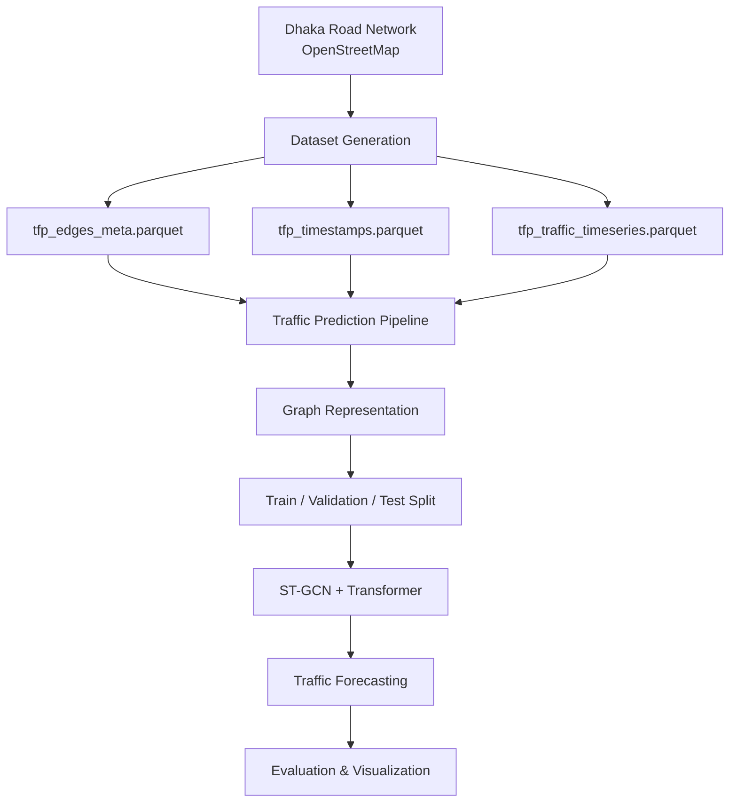
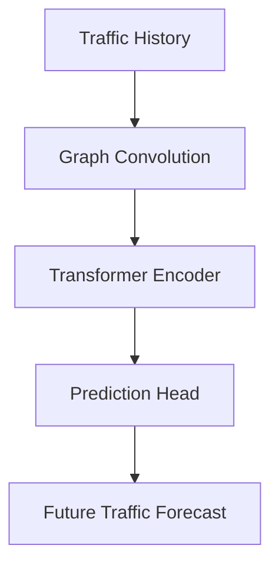

# Traffic Flow Prediction using Graph Neural Networks

## Introduction

Urban traffic congestion is a major challenge in rapidly growing cities such as Dhaka. Accurate traffic forecasting can support intelligent transportation systems, route optimization, and traffic management strategies.

This project presents a spatio-temporal traffic flow prediction framework that combines Graph Convolutional Networks (GCNs) and Transformer architectures to model both spatial dependencies among connected road segments and temporal traffic dynamics over time.

The project consists of two major stages:

1. Generation of a large-scale traffic dataset from the Dhaka road network.
2. Traffic flow prediction using a Spatio-Temporal Graph Convolutional Network (ST-GCN) with Transformer-based temporal modeling.

---

## Workflow



---

## Project Structure

```text
.
├── tfp_dataset_generator.ipynb
├── traffic_flow_prediction.ipynb
├── data/
│   ├── tfp_edges_meta.parquet
│   ├── tfp_timestamps.parquet
│   └── tfp_traffic_timeseries.parquet
├── plots/
│   ├── tfp_training_curve.png
│   ├── tfp_benchmark_comparison.png
│   ├── tfp_spatial_error_heatmap.png
│   └── forecast_example.png
└── README.md
```

---

## Dataset Generation

The dataset generation notebook creates a large-scale traffic dataset based on the Dhaka urban road network extracted from OpenStreetMap.

### Road Network Extraction

The road network is collected using OSMnx and converted into a graph representation containing drivable road segments.

For each road segment, the following attributes are extracted:

- Geographic coordinates
- Road type
- Road length
- Free-flow speed
- Capacity factor

### Traffic Simulation

Realistic traffic conditions are generated by incorporating:

- Morning peak traffic
- Evening peak traffic
- Weekday and weekend variations
- Road hierarchy effects
- Random traffic fluctuations

### Generated Dataset Files

#### tfp_edges_meta.parquet

Contains static road segment information including:

- Edge ID
- Source node
- Destination node
- Coordinates
- Road type
- Length
- Free-flow speed
- Capacity factor

#### tfp_timestamps.parquet

Contains temporal indexing information including:

- Timestamp index
- Datetime
- Day of week
- Hour
- Minute

#### tfp_traffic_timeseries.parquet

Contains dynamic traffic observations including:

- Timestamp index
- Edge index
- Travel time
- Current speed
- Traffic factor

---

## Dataset Statistics

| Property | Value |
|-----------|---------|
| Road Segments | 156,531 |
| Time Steps | 672 |
| Sampling Interval | 15 Minutes |
| Duration | 7 Days |
| Total Records | 105,188,832 |

---

## Model Architecture

The traffic forecasting model combines graph-based spatial learning with Transformer-based temporal learning.

### Spatial Learning

A Graph Convolutional Network captures spatial relationships among connected road segments using a line graph representation of the transportation network.

### Temporal Learning

A Transformer Encoder captures long-range temporal dependencies and recurring traffic patterns.

### Forecasting Pipeline



---

## Training Configuration

| Parameter | Value |
|------------|---------|
| Lookback Window | 12 |
| Forecast Horizon | 1 |
| Hidden Dimension | 64 |
| Attention Heads | 8 |
| Transformer Layers | 3 |
| Batch Size | 32 |
| Optimizer | AdamW |
| Loss Function | Huber Loss |

Training incorporates:

- Early stopping
- Learning rate warmup
- Cosine annealing scheduler
- Gradient clipping

---

## Data Split

| Dataset | Timesteps |
|----------|------------|
| Training | 470 |
| Validation | 101 |
| Testing | 101 |

### Generated Sliding Windows

| Dataset | Windows |
|----------|---------|
| Training | 458 |
| Validation | 89 |
| Testing | 89 |

---

## Results

### Training Performance

The model converges steadily with decreasing validation loss throughout training.


### Spatial Error Distribution

Prediction errors across the Dhaka road network are visualized using a spatial error heatmap.


### Benchmark Comparison

The proposed ST-GCN + Transformer model is compared against baseline forecasting approaches.


---

## Test Performance

| Metric | Value |
|----------|---------|
| MAE | 0.0837 |
| RMSE | 0.1141 |
| MAPE | 29.31% |

The model successfully captures both spatial and temporal traffic patterns and produces accurate short-term traffic forecasts.

---

## Statistical Validation

### Diebold–Mariano Test

| Statistic | Value |
|------------|---------|
| DM Statistic | -647.1621 |
| p-value | < 0.001 |

The results indicate a statistically significant improvement over persistence-based forecasting methods.

### Bootstrap Confidence Interval

| Metric | Value |
|----------|---------|
| MAE | 0.0837 |
| 95% Confidence Interval | [0.0836, 0.0837] |

---

## Installation

Clone the repository:

```bash
git clone https://github.com/your-username/traffic-flow-prediction.git

cd traffic-flow-prediction
```

Install dependencies:

```bash
pip install torch pandas numpy pyarrow scikit-learn matplotlib seaborn tqdm osmnx geopandas
```

---

## Usage

### Generate Dataset

Run the dataset generation notebook:

```bash
tfp_dataset_generator.ipynb
```

This notebook:

- Downloads the Dhaka road network
- Extracts road features
- Generates synthetic traffic data
- Exports Parquet datasets

### Train and Evaluate the Model

Run the traffic prediction notebook:

```bash
traffic_flow_prediction.ipynb
```

This notebook:

- Loads the generated datasets
- Constructs graph representations
- Creates temporal windows
- Trains the ST-GCN + Transformer model
- Evaluates forecasting performance
- Generates visualizations and benchmark results

---

## Future Work

- Real-time traffic prediction
- Multi-step forecasting
- Dynamic route recommendation
- Integration with live traffic APIs
- Graph Attention Networks (GATs)
- Adaptive routing systems for smart cities

---

## License

This project is intended for academic and research purposes. Users are free to use, modify, and extend the code with proper attribution.
